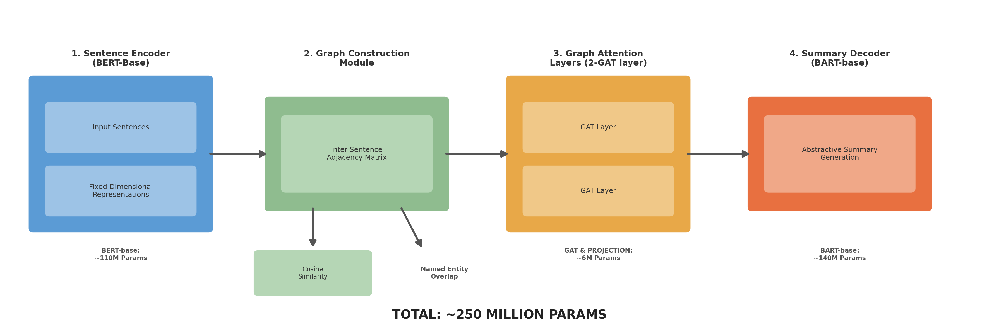

# HiGS: Architecture Specification

## Overview

**HiGS** (Hierarchical Graph-based Summarization) is a novel multi-document abstractive summarization model that explicitly models inter-document structural relationships through graph attention networks.

**Key Innovation:** Instead of treating multiple documents as a flat token sequence (like PRIMERA or LED), HiGS constructs a sentence-level document graph capturing entity co-references and semantic similarity across articles, then uses graph attention to reason over this structure before decoding.

**Parameters:** ~250M (BERT-base: 110M + GAT: 4M + BART-base: 140M)

---

## Architecture Diagram

*Fig 1. HiGS Architecture Pipeline — 4-stage model with ~250M total parameters*

---

## Mathematical Formulation

### 1. Sentence Encoding

Given a set of sentences $S = \{s_1, s_2, \ldots, s_n\}$ extracted from input documents:

$$h_i = \text{BERT}(s_i)[CLS] \in \mathbb{R}^{768}$$

### 2. Graph Construction

The adjacency matrix $A \in \{0,1\}^{n \times n}$ is defined as:

$$A_{ij} = \begin{cases} 1 & \text{if } \cos(h_i, h_j) > \tau \text{ or } E(s_i) \cap E(s_j) \neq \emptyset \\ 0 & \text{otherwise} \end{cases}$$

where $\tau = 0.75$ and $E(s)$ is the set of named entities in sentence $s$.

### 3. Graph Attention

For each GAT layer $l$:

$$\alpha_{ij}^{(l)} = \frac{\exp(\text{LeakyReLU}(a^T [W h_i^{(l)} \| W h_j^{(l)}]))}{\sum_{k \in \mathcal{N}(i)} \exp(\text{LeakyReLU}(a^T [W h_i^{(l)} \| W h_k^{(l)}]))}$$

$$h_i^{(l+1)} = \text{ReLU}\left(\sum_{j \in \mathcal{N}(i)} \alpha_{ij}^{(l)} W h_j^{(l)}\right)$$

### 4. Conditional Decoding

The graph-enriched representations are projected and fed to BART:

$$\hat{h} = W_{proj} \cdot g + b_{proj} \in \mathbb{R}^{n \times 768}$$

$$P(y_t | y_{<t}, \hat{h}) = \text{BART-Decoder}(\hat{h}, y_{<t})$$

### 5. Training Loss

Cross-entropy with label smoothing ($\epsilon = 0.1$):

$$\mathcal{L} = -(1-\epsilon) \sum_t \log P(y_t | y_{<t}, \hat{h}) - \epsilon \cdot H(U)$$

---

## Two-Phase Training Strategy

**Phase 1:** Train all components jointly (BERT + GAT + BART decoder)
- Learning rate: 3×10⁻⁵
- Full backpropagation through encoder and decoder

**Phase 2:** Freeze encoder + GAT, fine-tune decoder only
- Learning rate: 1×10⁻⁵
- Ensures the decoder adapts to graph-enriched representations

---

## Design Justifications

1. **Sentence-level encoding** (vs. flat tokenization): Enables explicit modeling of inter-sentence relationships, critical for multi-document scenarios where different articles describe overlapping events.

2. **Entity-overlap edges**: Named entities (persons, organizations, locations) naturally link related sentences across documents, capturing coreference chains without explicit coreference resolution.

3. **Cosine similarity edges**: Captures semantic overlap between sentences, enabling redundancy-aware aggregation.

4. **Dual tokenizers**: BERT tokenizer for encoding (encoder side) and BART tokenizer for generation (decoder side) — resolves vocabulary mismatch between encoder and decoder.

5. **Parameter efficiency**: At ~250M parameters, HiGS achieves competitive performance to 7B+ LLMs, demonstrating that structured inductive biases (graph attention) can substitute for raw scale.
