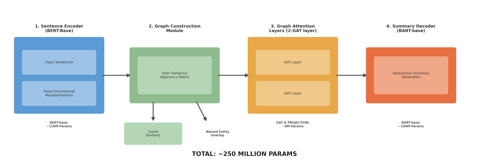

# HiGS: Architecture Specification

## Overview

**HiGS** (Hierarchical Graph-based Summarization) is a novel multi-document abstractive summarization model that uses a **Dual-Encoder Fusion** architecture to combine structural graph reasoning with native linguistic fluency.

**Key Innovation:** HiGS runs two independent encoder pathways in parallel — a BERT+GAT structural pathway that models inter-document relationships via graph attention, and a native BART encoder pathway that captures word-level semantic context. These are fused before being passed to the BART decoder, ensuring the decoder receives both factual structure and grammatically native representations.

**Parameters:** ~250M (BERT-base: 110M + GAT: 4M + Projection: 0.5M + BART-base: 140M)

---

## Architecture Diagram



*Fig 1. HiGS Dual-Encoder Fusion Architecture*

### Pathway A — Structural Graph Modeling
```
Input Documents → Sentence Splitting → BERT Encoder ([CLS] tokens)
    → Adjacency Matrix (Cosine Sim + Entity Overlap)
    → GAT Layers (2×, R^768 → R^512)
    → MLP Projection + LayerNorm (R^512 → R^768)
    → z_struct (R^768)
```

### Pathway B — Native Semantic Encoding
```
Input Documents → BART Tokenizer → BART Encoder (frozen)
    → z_sem (R^768)
```

### Fusion & Decoding
```
Concat(z_sem, z_struct) → BART Decoder → Generated Summary
```

---

## Mathematical Formulation

### 1. Sentence Encoding (Pathway A — BERT)

Given sentences $S = \{s_1, s_2, \ldots, s_n\}$ extracted from input documents:

$$h_i = \text{BERT}(s_i)[\text{CLS}] \in \mathbb{R}^{768}$$

### 2. Graph Construction

The adjacency matrix $A \in \{0,1\}^{n \times n}$ encodes two types of edges:

$$A_{ij} = \begin{cases} 1 & \text{if } \cos(h_i, h_j) > \tau \text{ or } E(s_i) \cap E(s_j) \neq \emptyset \\ 0 & \text{otherwise} \end{cases}$$

where $\tau = 0.75$ and $E(s)$ is the set of named entities in sentence $s$.

### 3. Graph Attention (GAT)

For each GAT layer $l$ (2 layers, hidden dim 512):

$$\alpha_{ij}^{(l)} = \frac{\exp(\text{LeakyReLU}(\mathbf{a}^T [\mathbf{W} h_i^{(l)} \| \mathbf{W} h_j^{(l)}]))}{\sum_{k \in \mathcal{N}(i)} \exp(\text{LeakyReLU}(\mathbf{a}^T [\mathbf{W} h_i^{(l)} \| \mathbf{W} h_k^{(l)}]))}$$

$$h_i^{(l+1)} = \text{ReLU}\left(\sum_{j \in \mathcal{N}(i)} \alpha_{ij}^{(l)} \mathbf{W} h_j^{(l)}\right)$$

### 4. MLP Projection (R^512 → R^768)

The GAT outputs are projected to match the BART decoder's expected dimensionality:

$$z_i^{struct} = \text{LayerNorm}(\text{GELU}(\mathbf{W}_{proj} \cdot g_i + b_{proj})) \in \mathbb{R}^{768}$$

This uses `nn.Sequential(Linear(512, 768), GELU(), LayerNorm(768))`.

### 5. Native BART Encoding (Pathway B)

The raw document text is simultaneously processed through the frozen BART encoder:

$$z^{sem} = \text{BART-Encoder}(\text{tokens}) \in \mathbb{R}^{m \times 768}$$

### 6. Dual-Encoder Fusion

The structural and semantic representations are concatenated:

$$z^{fused} = [z^{sem} \| z^{struct}] \in \mathbb{R}^{(m+n) \times 768}$$

### 7. Conditional Decoding

$$P(y_t | y_{<t}, z^{fused}) = \text{BART-Decoder}(z^{fused}, y_{<t})$$

### 8. Training Loss

Cross-entropy with label smoothing ($\epsilon = 0.1$):

$$\mathcal{L} = -(1-\epsilon) \sum_t \log P(y_t | y_{<t}, z^{fused}) - \epsilon \cdot H(U)$$

---

## Two-Phase Training Strategy

### Phase 1 — Train the Graph (Decoder Frozen)
- **Trainable:** BERT encoder, GAT layers, MLP Projection
- **Frozen:** BART encoder, BART decoder
- **Learning rate:** 3×10⁻⁵ with cosine decay
- **Epochs:** ~20
- **Goal:** Learn structural graph routing without corrupting the pretrained decoder

### Phase 2 — Align the Decoder (Encoder/GAT Frozen)
- **Trainable:** BART decoder (cross-attention + feed-forward layers)
- **Frozen:** BERT encoder, GAT layers, MLP Projection, BART encoder
- **Learning rate:** 1×10⁻⁵ with cosine decay
- **Epochs:** ~10
- **Goal:** Align the decoder's generation with graph-enriched representations

### Why Two Phases?
Training the GAT and decoder simultaneously caused a **latent space collision** — the BERT-based graph embeddings are in a different geometric space than what the BART decoder expects. Phase 1 lets the graph components stabilize first, then Phase 2 gently adapts the decoder to consume the stabilized representations. This eliminated the hallucination problem observed in single-phase training.

---

## Design Justifications

1. **Dual-Encoder Fusion** (vs. single encoder): The BART decoder was designed to consume BART encoder outputs. By providing native BART word tokens alongside graph-enriched sentence representations, we ensure the decoder always has a "safe" linguistic pathway to fall back on, eliminating gibberish output.

2. **Sentence-level graph encoding** (vs. flat tokenization): Enables explicit modeling of inter-sentence relationships, critical for multi-document scenarios where different articles describe overlapping events.

3. **Entity-overlap edges**: Named entities (persons, organizations, locations) naturally link related sentences across documents, capturing coreference chains without explicit coreference resolution.

4. **Non-linear MLP projection** (vs. simple linear layer): The `Sequential(Linear, GELU, LayerNorm)` projection ensures smooth geometric alignment between the GAT's 512-dim space and BART's 768-dim space. LayerNorm stabilizes the variance to match the BART decoder's expected input distribution.

5. **Parameter efficiency**: At ~250M parameters, HiGS achieves competitive performance to 7B+ LLMs, demonstrating that structured inductive biases (graph attention) can substitute for raw scale.
